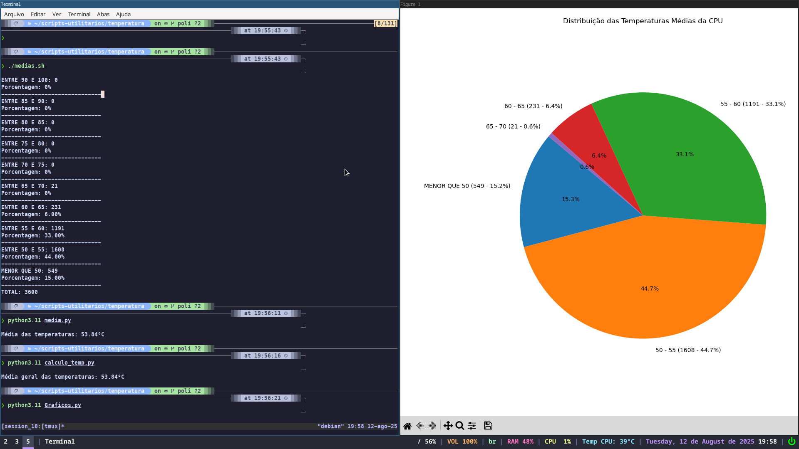
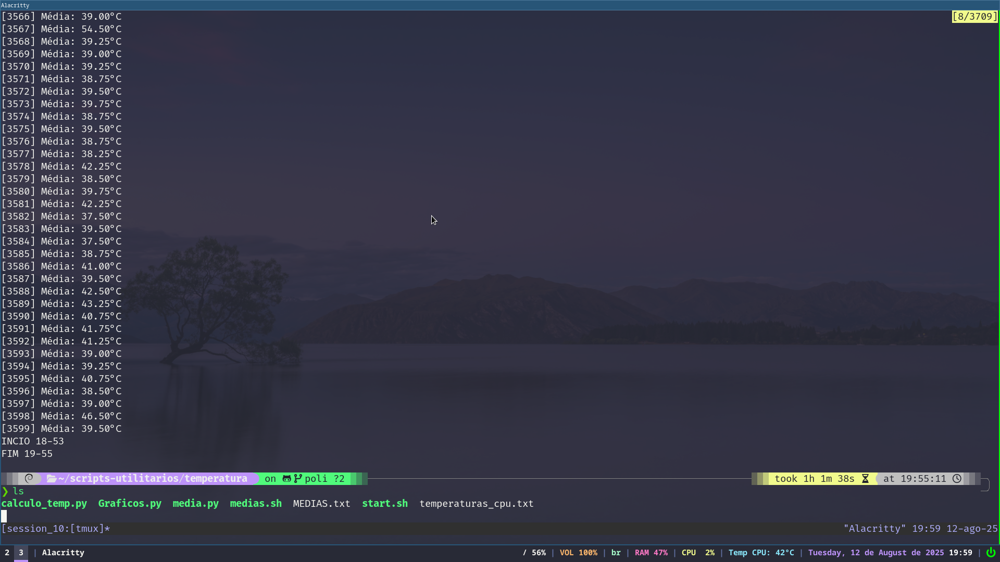
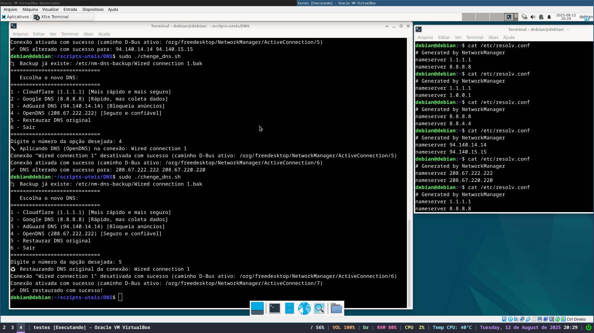

# 🛠️ Scripts Utilitários para Linux

Este repositório contém scripts simples e úteis ,como:

- 🔧 Alteração de DNS em /etc/resolv.conf
- 🌡️ Cálculo da média de temperaturas da CPU (testado para cpu com 8 nucleos utilizando o psensors)
- 📈 Geração de gráficos baseados nos dados de temperaturas com python 

---

## 📜 Scripts incluídos

| Nome do Script       | Linguagem | Função Principal                                                                 |
|----------------------|-----------|----------------------------------------------------------------------------------|
| `change_dns.sh`     | Shell     | Altera o DNS e faz backup das configurações antigas do arquivo `/etc/resolv.conf` o backup eh feito em `/etc/resolv.conf.bak` |
| `calculo_temp.py`    | Python    | Cálculo direto dos logs de temperaturas do arquivo MEDIAS.txt (este arquivo tem as medias da temperatura de quando o script start.sh eh finalizado)|
| `Graficos.py`        | Python    | Gera gráficos com base nos dados do arquivo `temperaturas_cpu.txt`              |
| `media.py`           | Python    | Mostra de forma simples e genérica a média das temperaturas de `temperaturas_cpu.txt` |
| `medias.sh`          | Shell     | Calcula a média de temperatura via terminal com base no arquivo `temperaturas_cpu.txt` |
| `start.sh`           | Shell     | Script **principal** serve para pegar a temperatura das cpu e tirar a media            | 

---


## ⚙️ Requisitos

- Sistema baseado em Linux (testado no **Debian 12**)
- **Python 3.x** para os scripts `.py`
- **`nmcli`** instalado (vem com o `NetworkManager`) para o script de DNS
- **psensors** (para leitura da temperatura da CPU)
---

## 🚀 Como usar

### 🔧 Instalar e `lm-sensors` 

```bash
sudo apt update
sudo apt install lm-sensors
```
### Habilitar o sensors
```bash
sudo sensors-detect
```

### 1. Alterar DNS 
esta na pasta DNS do repositorio
```bash
chmod +x change.sh
sudo ./change_dns.sh
```

### 2. Scripts de temperatura
O script `start.sh` inicia o processo de coleta e grava os dados de temperatura em dois arquivos:

- `temperaturas_cpu.txt`: dados de sensores(para cpu com 8 nucleos ) 
- `MEDIAS.txt`: médias registradas no final da execução

```bash
chmod +x start.sh
./start.sh
```
**os outros scripts servem para visualização dos logs desses arquivos**

## Prints dos Scripts







