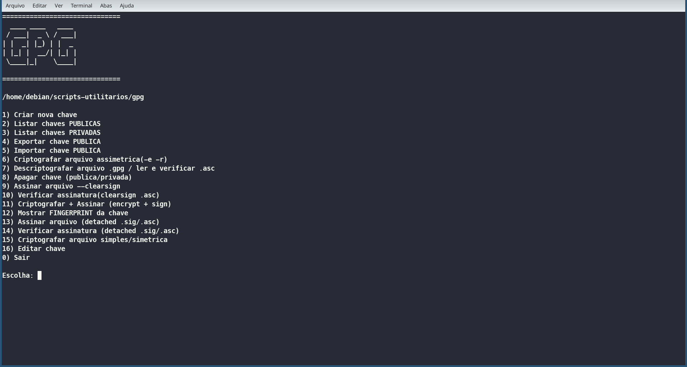
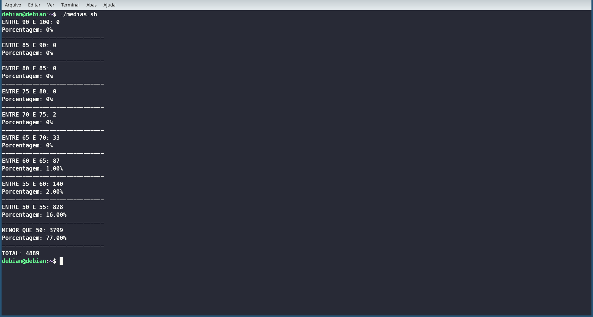

### 1. 🌐 Alterar DNS

```bash
chmod +x change_dns.sh
sudo ./change_dns.sh
```

### 2. 🌡️ Scripts de temperatura

```bash
sudo apt update
sudo apt install lm-sensors
```

#### Habilitar o sensors

```bash
sudo sensors-detect
```

```bash
python3 -m venv venv
source venv/bin/activate
pip install matplotlib
```

Executar

```bash
chmod +x start.sh
./start.sh
```

```bash
python3 calculo_temp.py
python3 Graficos.py
python3 media.py
./medias.sh
```

## Preview





