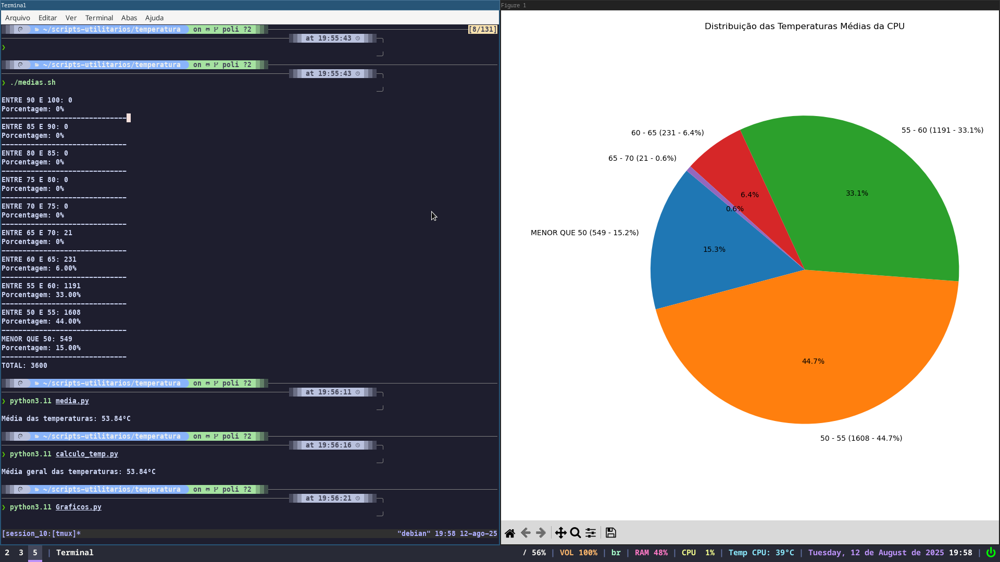
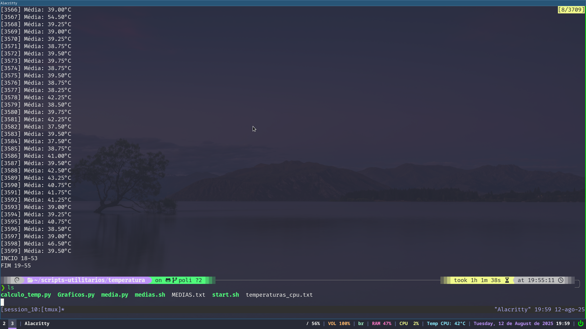
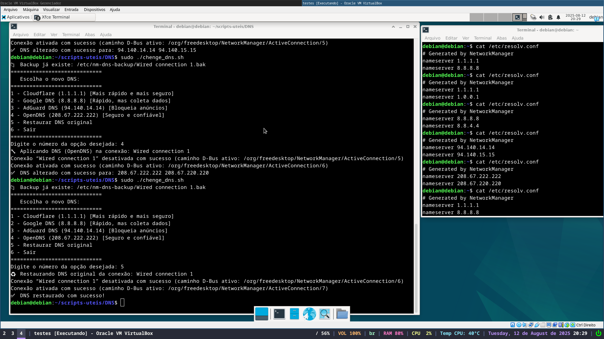

# 🛠️ Scripts Utilitários para Linux

Este repositório contém scripts simples e úteis ,como:

- 🌐 Alteração de DNS em /etc/resolv.conf
- 🌡️ Cálculo da média de temperaturas da CPU (testado para cpu com 8 nucleos utilizando o psensors)
- 📈 Geração de gráficos baseados nos dados de temperaturas com python
- 🔑 Geração de chaves ssh para o github

---

## 📜 Scripts incluídos

| Nome do Script       | Linguagem | Função Principal                                                                 |
|----------------------|-----------|----------------------------------------------------------------------------------|
| `change_dns.sh`     | Shell     | Altera o DNS e faz backup das configurações antigas do arquivo `/etc/resolv.conf` o backup eh feito em `/etc/resolv.conf.bak` |
| `calculo_temp.py`    | Python    | Cálculo direto dos logs de temperaturas do arquivo MEDIAS.txt (este arquivo tem as medias da temperatura de quando o script start.sh eh finalizado)|
| `Graficos.py`        | Python    | Gera gráficos com base nos dados do arquivo de log `temperaturas_cpu.txt`              |
| `media.py`           | Python    | Mostra de forma simples e genérica a média das temperaturas de `temperaturas_cpu.txt` |
| `medias.sh`          | Shell     | Calcula a média de temperatura via terminal com base no arquivo `temperaturas_cpu.txt` |
| `start.sh`           | Shell     | Script **principal** serve para pegar a temperatura das cpu e tirar a media e deixar nos logs **temperatura_cpu.txt** e **MEDIAS.txt**            | 
| `ssh.sh`           | Shell     | Gera chaves ssh  em ~/.ssh/ e as configurações git como nome e email     | 
| `remove_ssh.sh`           | Shell     | Remove chaves ssh e as configurações git            | 


---

## ⚙️ Requisitos

- Sistema baseado em Linux (testado no **Debian 12**)
- **Python 3.x** para os scripts `.py`
- **`nmcli`** instalado (vem com o `NetworkManager`) para o script de DNS
- **lm-sensors** (para leitura da temperatura da CPU)


---


### 1. 🌐 Alterar DNS 

Esta na pasta DNS do repositorio

```bash
chmod +x change.sh  
sudo ./change_dns.sh  
```
---
### 2. 🌡️ Scripts de temperatura
#### 🚀 Como usar

#### 🔧 Instalar e `lm-sensors` 
```bash
sudo apt update  
sudo apt install lm-sensors  
```
#### Habilitar o sensors

```bash
sudo sensors-detect  
```

O script `start.sh` inicia o processo de coleta e grava os dados de temperatura em dois arquivos:

- `temperaturas_cpu.txt`: dados de sensores(para cpu com 8 nucleos )  
- `MEDIAS.txt`: médias registradas no final da execução  

```bash
chmod +x start.sh  
./start.sh  
```


**Os outros scripts abaixo servem para visualização dos logs desses arquivos:**
- temperaturas_cpu.txt
- MEDIAS.txt
```bash
python3 calculo_temp.py  
python3 Graficos.py  
python3 media.py  
./medias.sh  
```

---
### 3. 🔑 Script de chaves SSH
Este script permite criar chaves, iniciar o **ssh-agent** e testar a conexão com o github
```bash
chmod +x ssh.sh  
./ssh.sh  
```
Para **remover** as chaves e as configurações do git 
```bash
chmod +x remove_ssh.sh  
./remove_ssh.sh  
```
---
### 🐍 Observação : Criar ambiente virtual Python e instalar dependências

Antes de executar os scripts Python, é recomendado criar um ambiente virtual para isolar as dependências:

```bash
python3 -m venv venv  
source venv/bin/activate  
pip install matplotlib  
```
para sair do venv

```bash
deactivate  
```
---


## Preview

  

  

  

este é meu readme estou adiconando a parte de ssh , preciso de sugestões tipo icones ou algo parta melhora 
